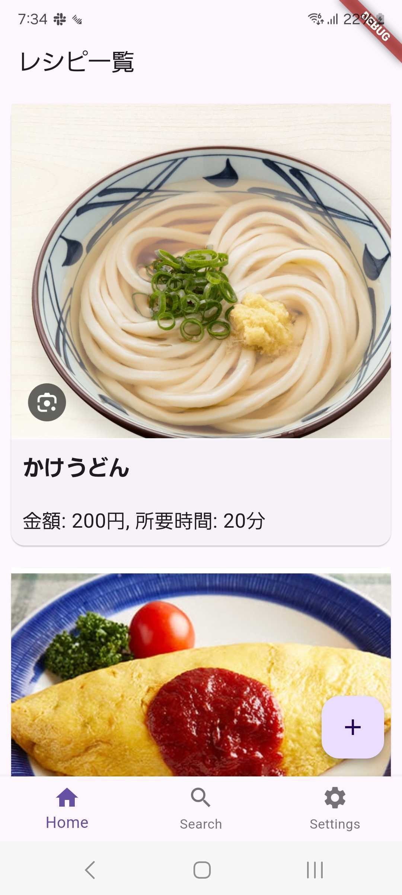
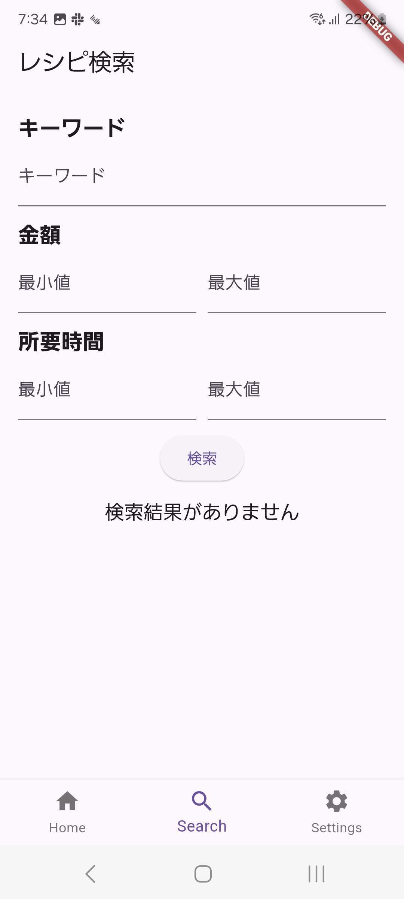
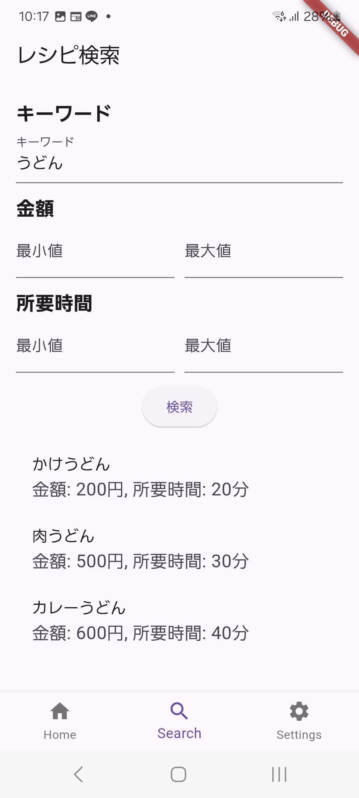
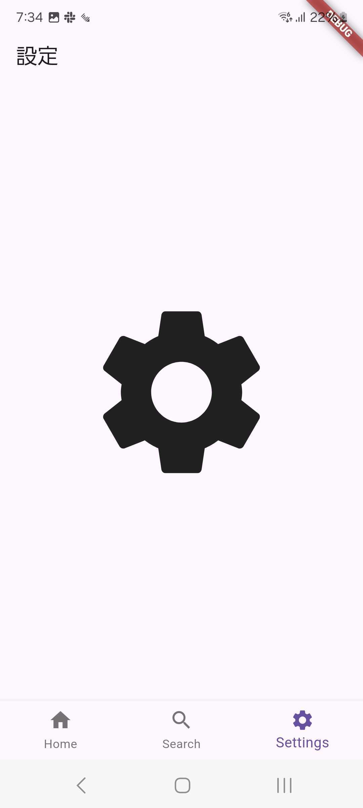
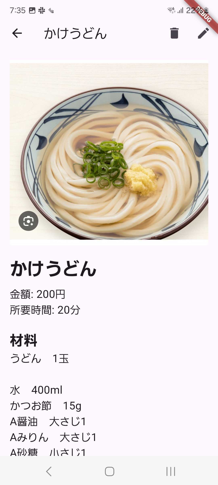
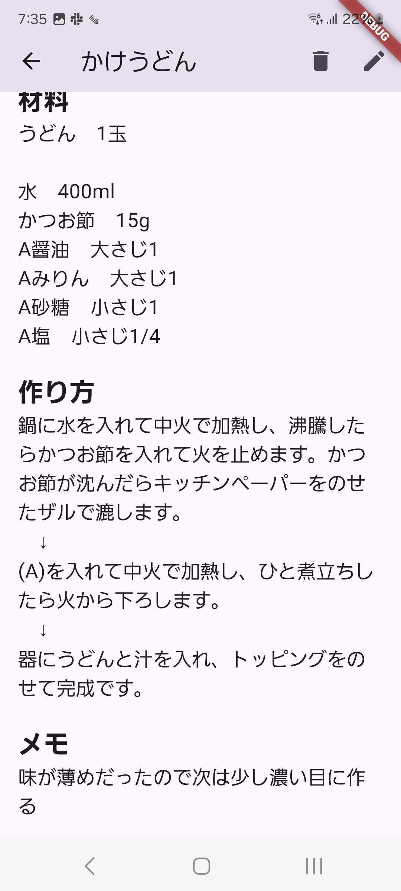
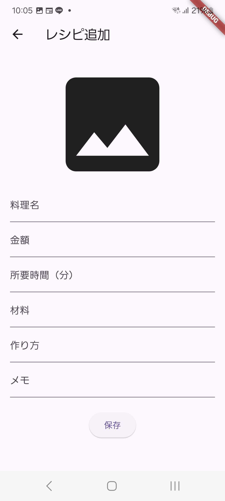
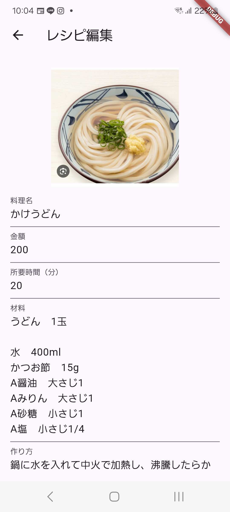
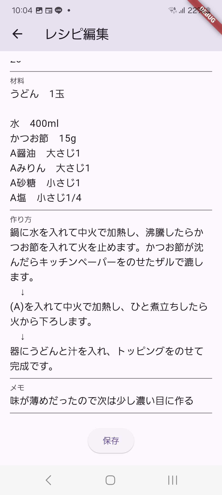
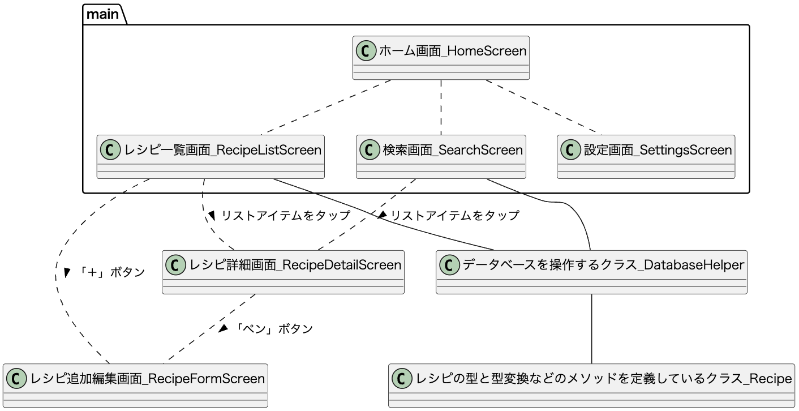

## 仕様
### ホーム画面
①料理一覧画面、②検索画面、③設定画面を画面に表示し、一番上に表示されるものを切り替えることで画面を切り替える

### レシピ一覧画面

作成したレシピが一覧で表示される。画面に入りきらない場合はスクロールできる。
一覧にはレシピの「料理の写真」「タイトル」「金額」「所要時間」が表示される。
各レシピの写真をタップすることで各【レシピ詳細画面】に飛ぶ。
右下の「＋」ボタンで【レシピ追加・編集画面】に飛ぶ。

### 検索画面

キーワード検索：キーワードを入れるとそのキーワードがタイトルに含まれるレシピを検索することができる
範囲絞り込み：金額、所要時間で上限と下限を設定しその範囲内のレシピを検索することができる
キーワード検索と各範囲絞り込みは併用可能

### 設定画面

今後設定機能を追加した時のために画面だけ用意しておいた。今は仮の画面としてテキスト「設定画面」を画面中央に表示する。

ホーム画面（料理一覧）、検索画面、設定画面で共通の仕様
画面下部にバーを配置し、左から順に「Home」「Search」「Settings」のアイコンを配置する。
それぞれが【ホーム画面（料理一覧）】【検索画面】【設定画面】に対応し、各ページに飛べるようにする。

### レシピ詳細画面

上から順に
・料理の写真
・タイトル（必須）
・金額
・所要時間
・材料
・作り方
・メモ（味が濃かったから次は薄めなどの補足情報を書くところ）
の項目がある。

未入力の項目は表示されずに入力されている項目のみが表示される。
右上のペンのアイコンを押すと【レシピ追加・編集画面】に飛ぶ。
右上のゴミ箱のアイコンを押すとレシピを消去できる。（削除前に警告のダイアログが出る）

### レシピ追加・編集画面

料理ページの追加・編集を行う。
料理の写真はスマホのフォルダ内から選ぶことができる。
タイトルは必須で未入力のまま保存しようとすると入力を促すダイアログが出る。
保存ボタンを押すとレシピが保存される。

## クラス図
自分がわかりやすいようにクラス図を作成したので載せておきます。
ツールはPlantUMLを使用しました。
⚠️厳密にクラス図の作成ルールに則って作成したわけではなく自分なりのものなので変なところがあるかもしれません。

