## 概要
課題の期限管理に特化したカレンダー・TODOリストアプリです。期限と必要時間を入力すると、予定の空いた時間にタスクブロックを配置できます。直感的な操作で1日の予定を組み、空き時間を有効活用しましょう！

---
## 使い方と機能
### 1．カレンダーで予定を確認
カレンダー画面では日ごとの予定や課題の期限などを確認できます。特定の日をタップすると詳細な予定を表示します。
### 予定と期限の表示
課題の期限の日には丸印で示し、詳細画面の上部に表示します。
| カレンダー画面 | 予定詳細 |
|:---:|:---:|
|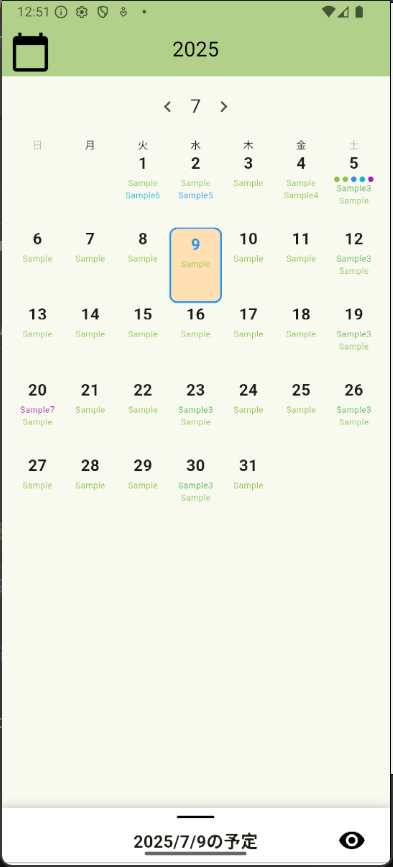|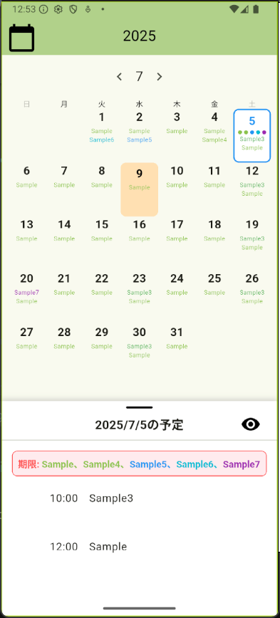|

### ボタンの役割
ボタンをタップすると、今日のToday画面に移ります。また、ボタンをタップすると、着目していた日のToday画面に移ります。

### 2．Today画面
ここでは、1日の予定リストを確認し、タスクブロックの配置・削除を行うことができます。
### 予定リスト
その日の時間ごとの予定を確認できます。色づいているものがタスクブロックであり、タイトルとコメントが表示されます。また、左上のカレンダーボタンをタップすると、カレンダー画面に移ります。
| Today画面 |
| :---: |
| 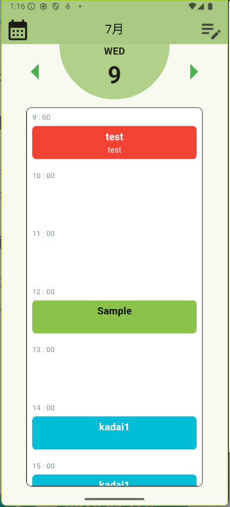 

### 日付け遷移
日付けの左右にある矢印をタップすることで、次の日や前の日に移動できます。表示される予定もその都度切り替わります。

| 昨日 | 明日 |
| :---: | :---: |
| 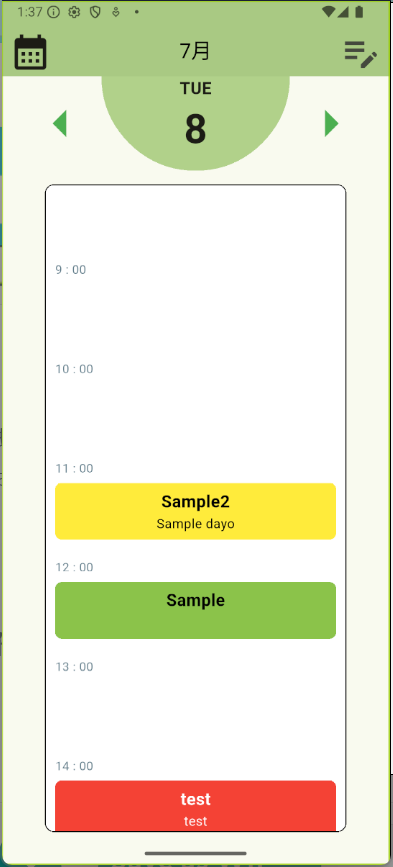 | 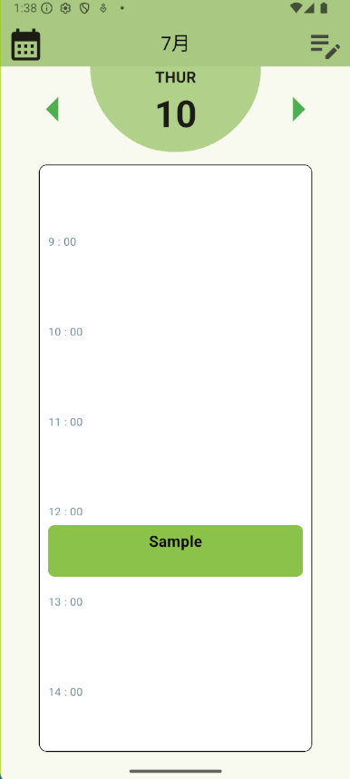|
 
### 編集モード
右上の編集ボタンをタップすると、編集モードに入ります。編集モードでは、タスクブロックの配置、削除、新規作成、タスクの編集を行うことができます。
- **タスクブロックの配置**

| 編集画面 | 時間を選択 し、未配置ブロックをタップ | 次の空いている時間に移動 | 
| :---: | :---: | :---: | :---: |
| 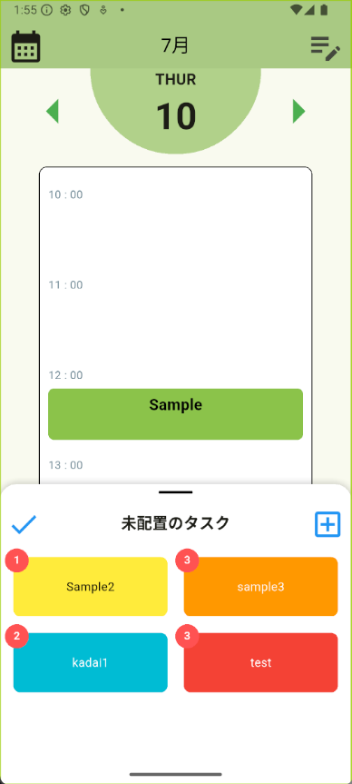 | 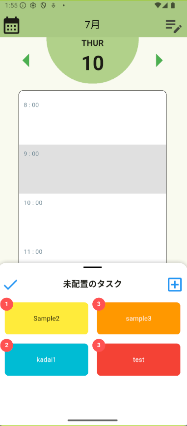 | 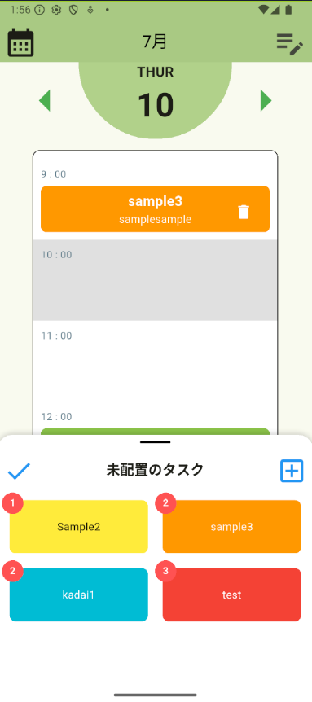 | 

- **配置したブロックの削除**

| ゴミ箱ボタンのタップ | 取り除く |
| :---: | :---: |
| 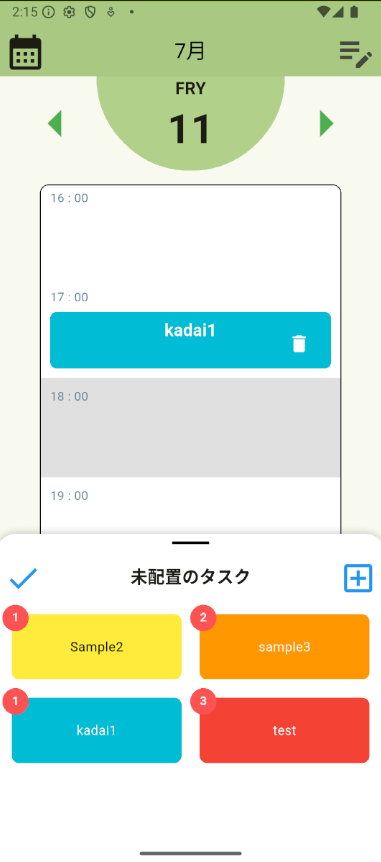 | 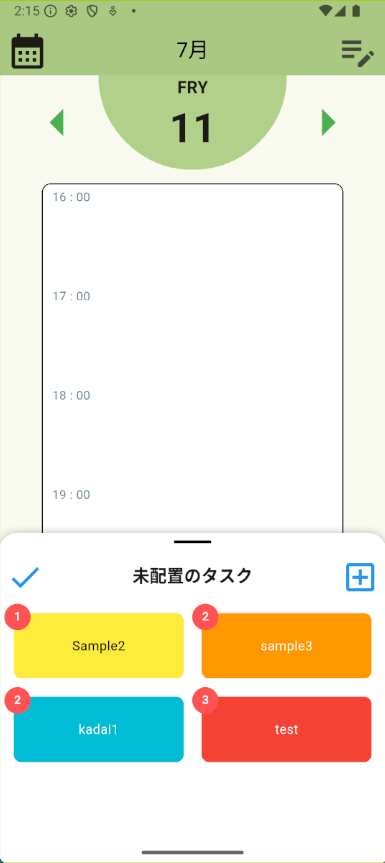 |

左上の保存ボタンを押すことで、加えた変更が保存できます。また、右上の新規作成ボタンを押すと、ブロック作成画面に移ります。
編集中も次の日や前の日に移ることも可能ですが、保存せずに別日に移ったり、ブロック作成画面などに移動しようとした場合は、確認のポップアップが表示されます。
| 確認画面 |
| :---: |
| 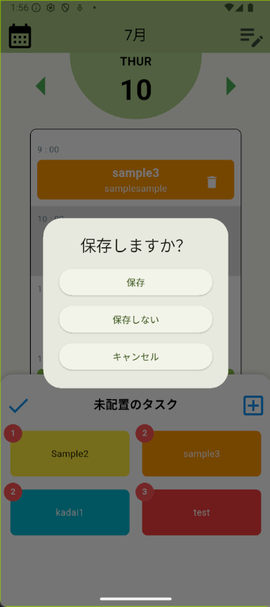 |

### 3．ブロック作成・編集
編集モードでタスクブロックの新規作成ボタンを押すと、ブロック作成画面に移動します。
### タスクブロックの新規作成
予定や課題などのタイトルと、必要時間、色といった必須項目を入力し、Saveボタンを押すことで必要時間の個数分タスクブロックが生成されます。
| 新規作成画面 | 繰り返しも選択可能 | 期限の選択 | 
| :---: | :---: | :---: | :---: |
| 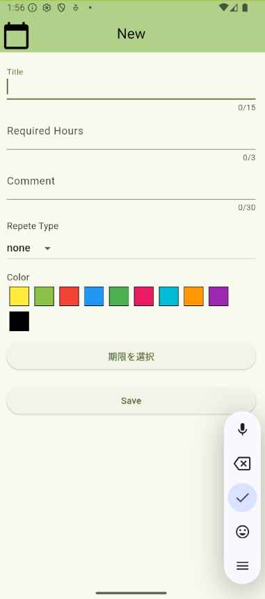 | 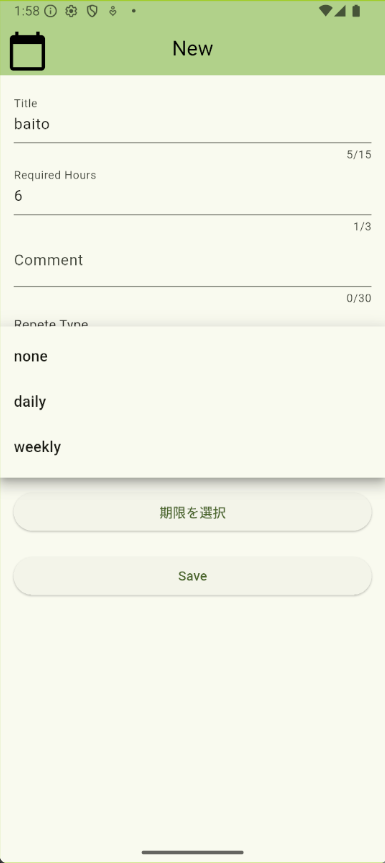 | 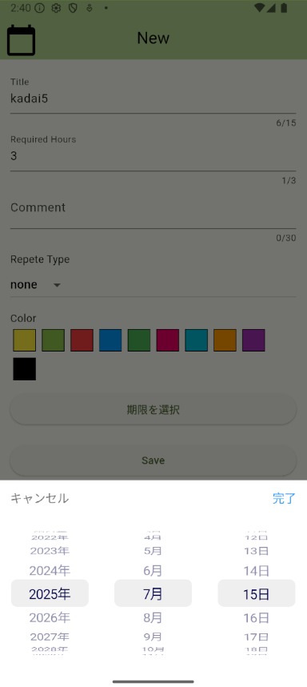 | 
### タスクの編集
Today画面の編集モード中に未配置ブロックを長押しすると、「編集」ボタンが表示されます。このボタンをタップすることで、タスク自体の編集をすることができます。タスク編集画面の右上には削除ボタンがあり、タスク自体を削除します。このとき、確認のポップアップを表示します。

| 編集ボタンの表示 | タスク編集画面 | 削除確認 | 
| :---: | :---: | :---: | 
| 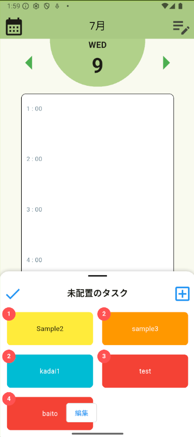 | 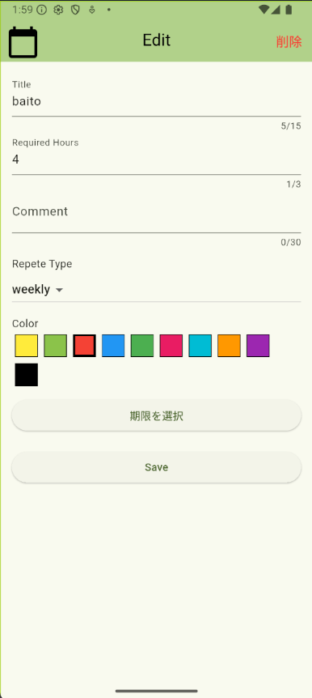 | 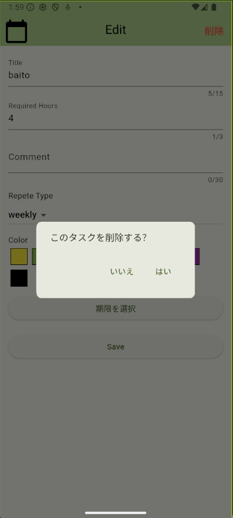 | 