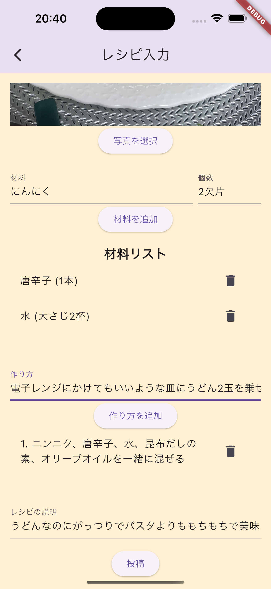
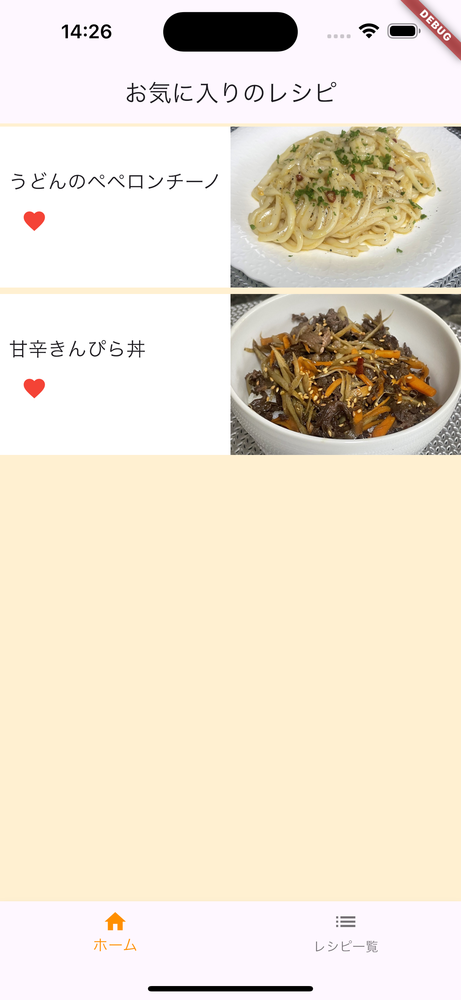
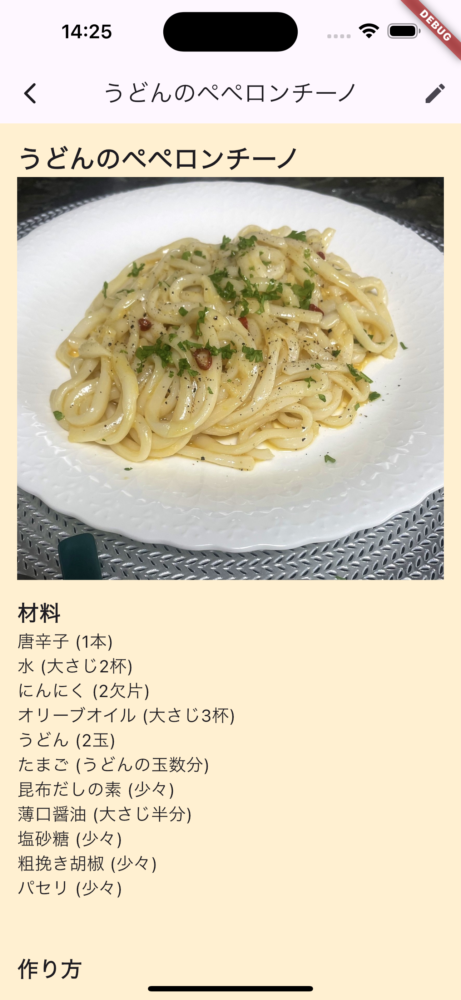
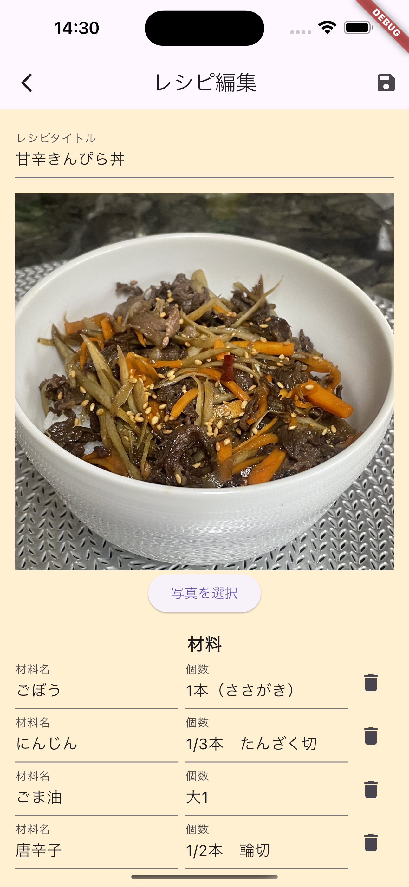

## 概要
作った料理の写真や材料、作り方、説明などをいつでも見返せるようにメモして保存できるアプリです

## 使い方
### 料理をメモする
レシピ入力ページでは料理の名前、写真、材料、レシピの説明をメモして保存することができます

### 料理を一覧で見る
レシピ一覧ページでは自分のメモした料理を一覧で見ることができます
また、お気に入りのレシピにハートマークをつけておくとホームページでお気に入りのレシピだけをまとめて見ることができます

### メモしたレシピを閲覧
レシピ一覧からレシピの詳細ページに飛ぶことができます
ここではメモしたレシピの詳しい情報を見ることができます

### メモしたレシピを編集
レシピの詳細ページ右上のアイコンを押すとレシピ編集ページに飛ぶことができます
ここではメモしたレシピを編集することができます
